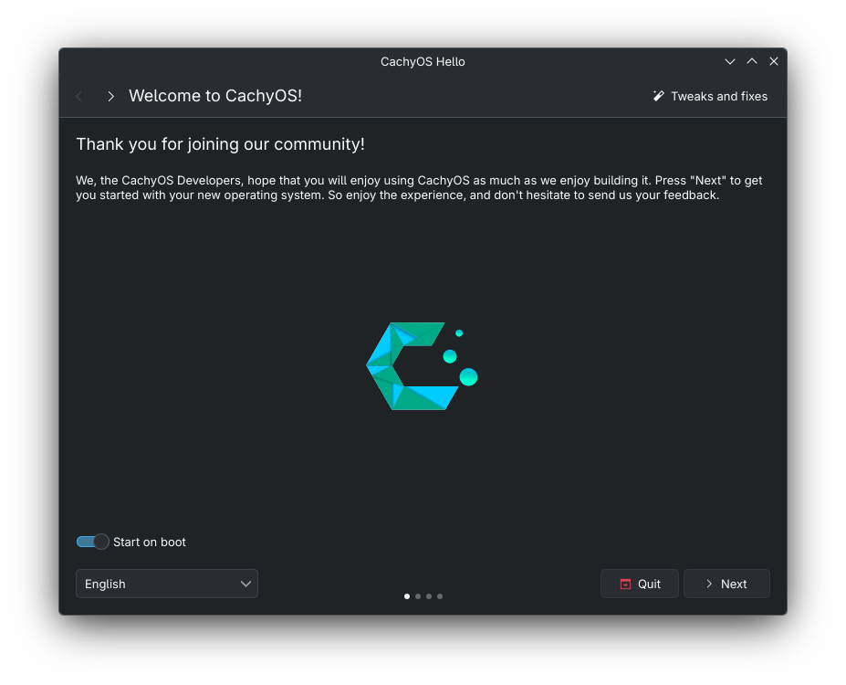
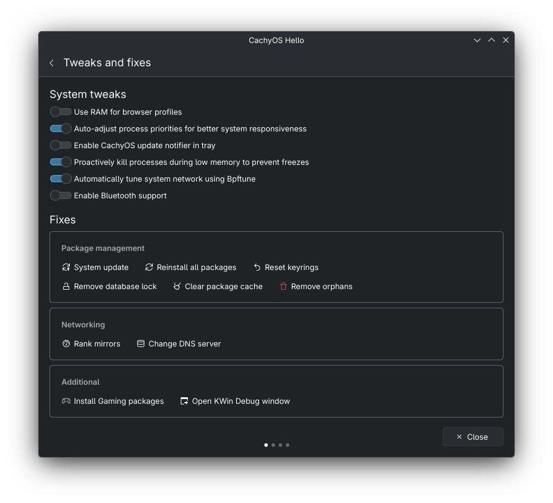

# CachyOS Hello

Welcome screen for CachyOS written in QML/C++.





## Dependencies (Arch Linux)
### Runtime
- qt6-base
- qt6-declarative
- kirigami
- qqc2-desktop-style
### Build deps
- base-devel
- cmake
- qt6-base
- qt6-declarative
- qt6-tools
- kirigami
- qqc2-desktop-style

```bash
sudo pacman -S base-devel cmake qt6-base qt6-declarative qt6-tools kirigami qqc2-desktop-style
```


## Translations

If you want to generate new strings in translation files, run `update_translations` build target:
```bash
cd build
cmake --build . --target update_translations
```

